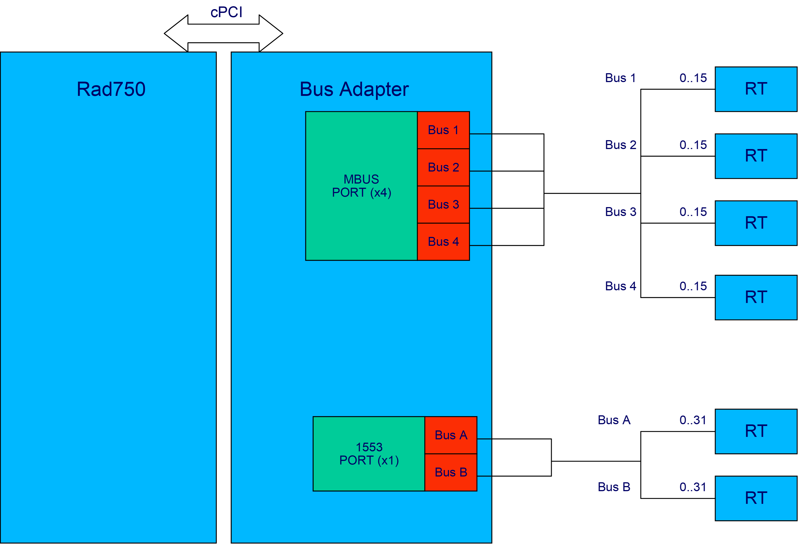
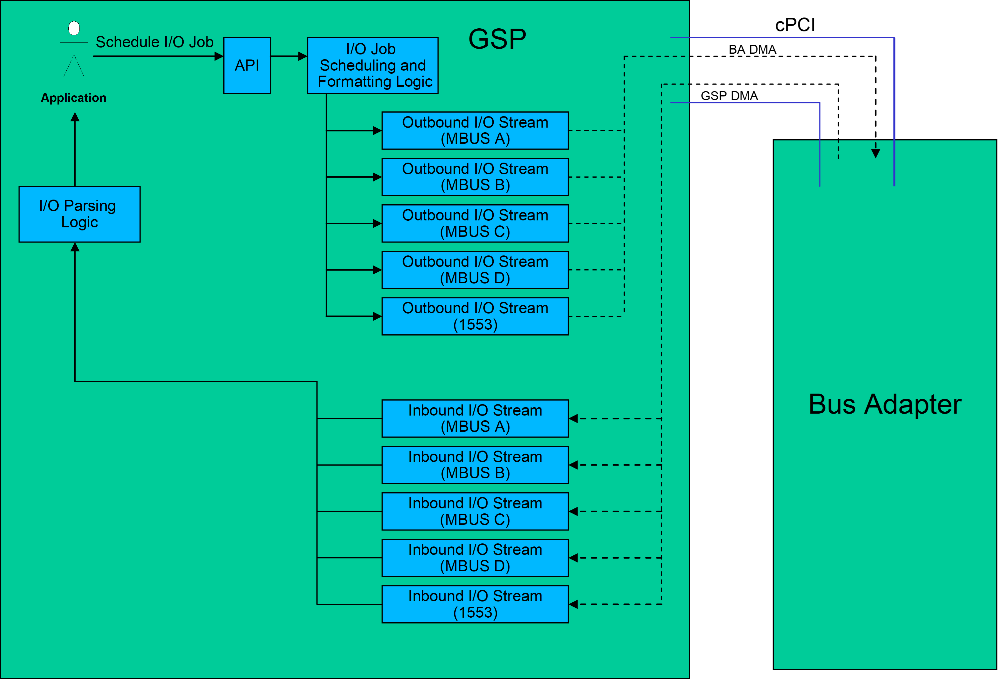
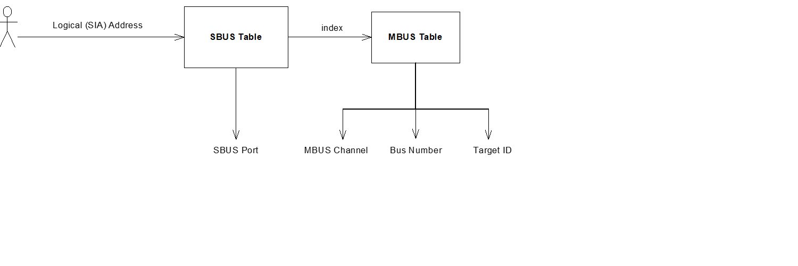
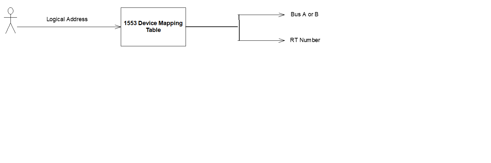
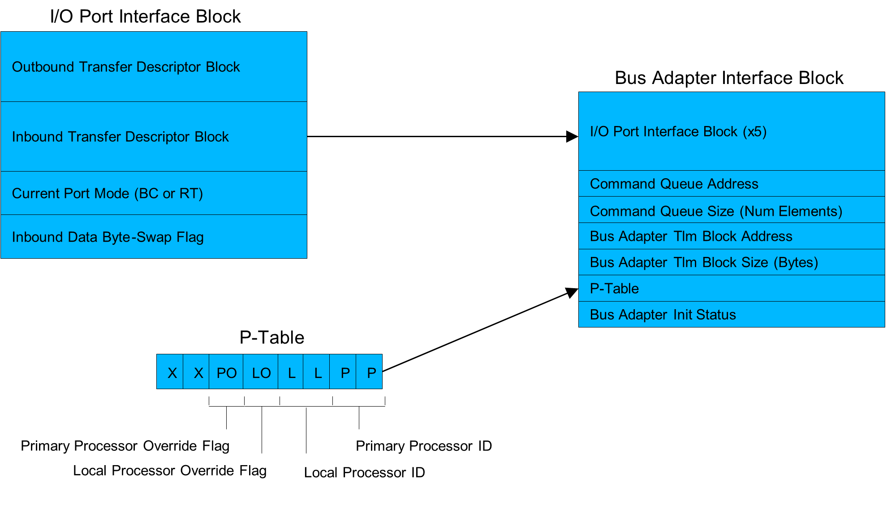
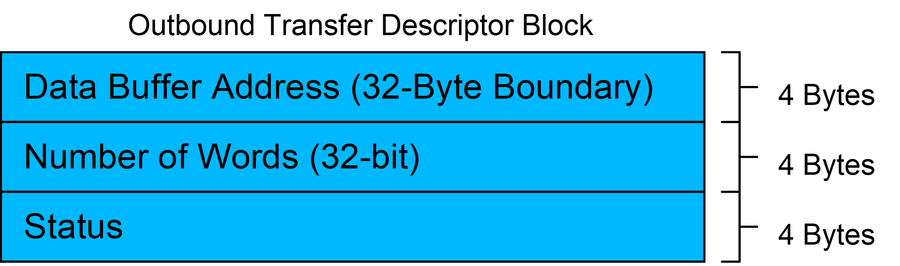
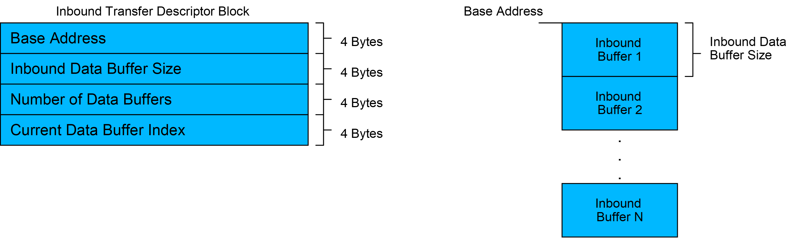
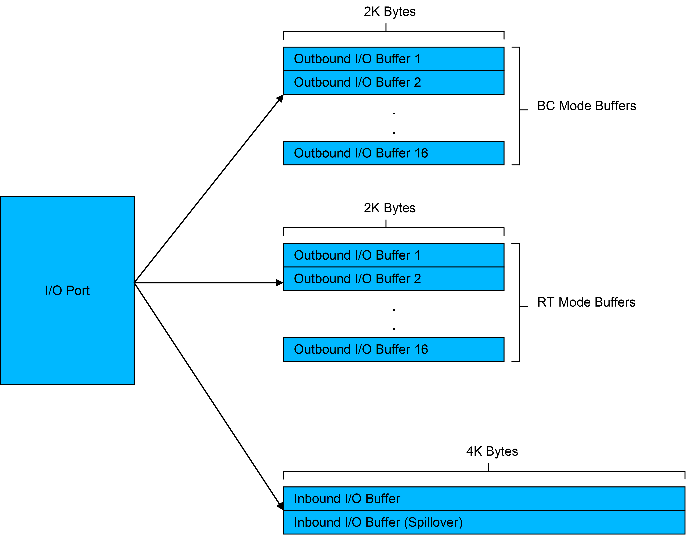
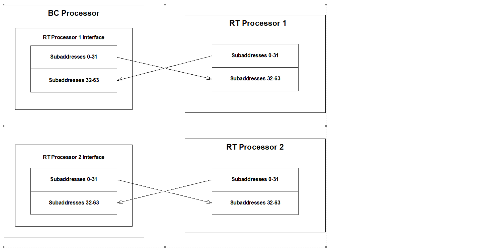

The I/O Subsystem is responsible for providing the interface between Applications on the GSP and Remote Terminal (RT) devices such as Star Trackers.
These RT devices are either on a high-speed serial bus (RS-485) or a 1553 bus. 

A RS-485 bus, also referred to as MBUS, has three types of MBUS RTs:
1.	Generic MBUS RT devices. 
- These are Telemetry Encoders, Command Decoders, and CCLs.
2.	IOBIC devices. 
- These are all of the ACE trays.
3.	Router devices. 
- Supported devices that can be accessed through a Router are SIAs, M500s, and SySIIs.

Examples of devices that communicate on the 1553 bus:
1.	Star trackers 
2.	Inter Processor communication (See  Inter-Processor Communication for details).

I/O interfaces with the Bus Adapter over a compact PCI bus. The Bus Adapter provides the gateway to the MBUS and 1553 channels. The baseline architecture supports four MBUS channels and one 1553 channel. Each MBUS channel provides four individual buses, whereas the 1553 channel has two distinct buses. 

# Operation

I/O data can be thought of as data formatted in outbound buffers for use on Remote Terminals and processed data received in the inbound buffers for use on the GSP Applications. 

The outbound data encodes read and write requests to the RT devices, and the inbound data contains responses for those requests. 

I/O requests are scheduled and sent out on a subcycle basis, and can be scheduled up to one major cycle in advance 

At the beginning of each subcycle, I/O sends out the I/O requests scheduled for that subcycle and processes all available I/O responses, which are fed back in First In First Out (FIFO) fashion.  I/O maintains separate I/O buffers for outbound requests for all sixteen subcycles, which are populated when Applications create and schedule requests.

# Bus Adapter Interface
Bus Adapter is the gateway between the Rad750 GSP and RT devices. The Bus Adapter is responsible for driving the MBUS Controller and the 1553 hardware. I/O communicates with the Bus Adapter via a PCI memory mapped interface.

Every sub-cycle, I/O initializes a series of descriptors that inform the Bus Adapter about all pending outbound data. I/O signals the Bus Adapter via an interrupt that there is new I/O data ready to be sent out. 

The Bus Adapter then pulls all of this data into its local memory and sends it out on the appropriate bus (MBUS or 1553). As the data is sent out on the buses, and responses are received, the Bus Adapter updates a series of inbound descriptors that let I/O know how much new data is ready to be processed.

Every sub-cycle, I/O will pull all of the available inbound data into its local memory and will process it as it arrives, passing the results back to the Applications.

Applications interact with I/O via a Job interface. A Job consists of one or more Transactions targeted to a specific RT device. A Transaction refers to any atomic interaction with an RT, but can simply be thought of as a read or write operation. 

# Application Interface Overview
An Application can perform the following functions on a Job:
1.	Create and Schedule a Job
2.	De-schedule a Job.
3.	Disable a Job.
4.	Enable a Job.
5.	Enable a Job Once.
6.	Get Status of a Job.

# Inter-Processor Communication Interface Overview

I/O also provides the interface for Applications to route data between processors. The bus controller processor can communicate with one or two processors that are RTs on the 1553 bus. 

I/O manages the flow of 1553 traffic between the processors, and provides the following mechanisms for inter-processor communication:
1.	Read a block of memory from a remote processor.
2.	Write a block of memory to a remote processor.
3.	Enqueue a message in a Registered Queue of a remote processor.
4.	Find out which is the local processor number.
5.	Find out which is the primary processor number.
6.	Determine if the local processor is primary.

# RT Device Addressing
RT Devices are addressed by Applications using a unique logical address. 

There are four categories of RTs: 
1.	Generic MBUS RTs 
2.	IOBIC (I/O Bus Integrated Circuit) RTs 
3.	Router RTs 
4.	1553 RTs 

## Generic MBUS RT and IOBIC RT:
I/O has to map the logical address to a physical channel number (0-3), bus number (0-3), and MBUS target ID (0-15). 

## Router/SIA RT:
In addition to all the inputs listed for the Generic MBUS and IOBIC RTs, devices in this category require a SBUS port number (0-63). 
An SBUS Table maps logical Router/Serial Interface Adapter (SIA) devices (by SIA address) to an index in the MBUS Table, and provides the SBUS port number. 

## 1553 RT:
1553 RT devices have to be mapped to an RT address (0-31) and a bus (A or B). 
A 1553 device mapping table maps logical 1553 device addresses to a specific bus and RT number.

## Bus Adapter Interface Architecture
The GSP and Bus Adapter communicate over shared memory, which is mapped in the PCI memory space. A fixed block of the Bus Adapter SRAM is dedicated to the Bus Adapter Interface Block. This block is located at address 0x100000 from the Bus Adapter’s perspective, which translates to 0xE0100000 from the GSP perspective.  

The Bus Adapter Interface block consists of:
•	information which provides mechanisms for outbound and inbound I/O data transfer 
•	a P-Table to indicate the local processor number and which processor number is currently primary 
•	a link to the Command Message Queue 
•	a link to the Bus Adapter’s telemetry block
•	a status word to indicate that the Bus Adapter has finished initialization.

### Outbound Data Transfer Interface
For each of the five I/O Ports there is an Inbound Transfer Descriptor Block which is written to by the Bus Adapter, and provides I/O with all information necessary to retrieve available inbound data.

I/O provides the Bus Adapter with the address of the outbound data buffer it wants to transfer and the number of 32-bit words contained in the buffer. It then sets the Status field to indicate that there is a data transfer pending. I/O performs this action for each Port, and then signals the Bus Adapter via interrupt to process the descriptors and transfer the data. After the data transfer is complete, the Bus Adapter will update the Status field to indicate that the data was successfully transferred, or it will provide a specific error code if it could not complete the transfer.

### Inbound Data Transfer Interface
For each of the five I/O Ports there is an Inbound Transfer Descriptor Block which is written to by the Bus Adapter, and provides I/O with all information necessary to retrieve available inbound data.

As I/O inbound response data is received, it is inserted into a data structure which consists of a circular buffer of individual inbound data buffers that have fixed size. The Bus Adapter provides the base address of this circular buffer, the number of inbound data buffers, and the size (in 32 bit words) of each inbound data buffer. As data comes in, the Bus Adapter updates the index of the inbound buffer that is currently being filled. Every sub-cycle, I/O will compare the current data buffer index with the index of the last buffer it read. With this comparison, I/O can compute how much inbound data is available for processing, and can set up an inbound DMA transfer.

## DMA Controller
I/O uses a Direct Memory Access (DMA) engine located on the Rad750 Bridge Chip to facilitate the transfer of I/O response data from the Bus Adapter’s SRAM to local SRAM. This class (DMA _Controller) is responsible for driving the DMA Engine.

## IO Port Controller
The I/O Port Controller class is responsible for managing I/O data to and from an I/O Port. There are five Port Controller objects (one for each Port). A Port Controller object interfaces with a Bus Adapter Port Interface object to setup outbound and inbound transfer of I/O data.

Finally, it provides the interface between I/O API Job calls and the Outbound Buffer Manager objects that contain the Jobs.

A Port Controller has thirty-two Outbound Buffer Managers that it interfaces with. This is because there are separate outbound buffers for each of the sixteen subcycles, and there are separate sets of outbound buffers for BC and RT mode. The BC and RT states operate exactly the same, except that in outbound processing the BC state prepares an outbound buffer from the BC set, and the RT state prepares an outbound buffer from the RT set.

## 1553 Subaddress Xfer

