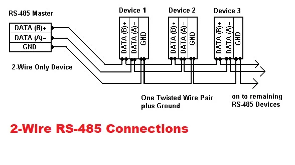

RS485 is a common communications standard that is widely used in data acquisition and control applications. 
One of its main advantages is that it allows putting several RS485 devices on the same bus which makes it possible for multiple nodes to connect with each other.

# What is RS-485?
RS-485 (currently known as EIA/TIA-485) is a standard interface of the physical layer of communication, a signal transmission method, the 1st level of the OSI (Open System Interconnection) model. RS-485 has been created in order to expand the physical capabilities of RS-232 interface.

The serial EIA-485 connection is done using a cable of two or three wires: a data wire, a wire with inverted data, and, often, a zero wire (ground, 0 V). This way, transmitters and receivers exchange data via a twisted-pair cable of 22 or 24 AWG solid wires.

The main idea here is to transport one signal over two wires. While one wire transmits the original signal, the other one transports its inverse copy. Such transmission method provides high resistance to common-mode interference. The twisted-pair cable that serves as a transmission line can be shielded or unshielded.

Communication network built on the RS-485 interface consists of transceivers connected by a twisted pair (two twisted wires). The basic principle of RS-485 interface is differential (balanced) data transmission. That means one signal is transported over two wires. With that, one wire of the pair transmits the original signal and the other one transports its inverse copy.

As a result of differential signal transmission there is always a potential difference between the wires. This ensures high resistance to common mode interference. In addition, the twisted pair may be shielded, which ensures the protection of transmitted data. All this allows sending data over long distances at relatively high speeds, which can reach 100 kbits/s at 4000 feet.

## What is RS485 communication protocol?
By the nature of RS-485 interface, RS-485 devices cannot transmit and receive data at the same time, as it leads to a conflict of transmitters. Therefore, the deterministic behavior is mandatory to avoid collisions of data packets.

In RS485 communication protocol, the commands are sent by the node which is defined as a master. All other nodes connected to the master receive the data over RS485 ports. Depending on the information sent, zero or more nodes on the line respond to the master.

## Main Features
1. Two-way data exchange via one twisted pair of wires;
2. support for several transceivers connected to the same line, i.e., the ability to create a network;
3. long length of the communication line;
4. high transmission speed.

While RS232 devices connect over text (ASCII) protocols, most RS485 devices use Modbus.

Modbus is a serial communications protocol that is widely used by industrial electronic devices. In Modbus, the connection is established between a master (host) and slaves (COM-based devices)*. Modbus helps access the configuration of the devices and read the measures.

The data exchange is initiated by a host. The host can switch its RS-485 driver to the transmission mode on its own, while the other RS485 drivers (slaves) work in the receiving mode. In order for a slave to answer the host over the communication line, the 'master' sends it a special command, which gives the intended device the right to switch its driver into a transmission mode for a certain time.

| Protocol	| RS232	| RS485 |
  ---       | ---   | ---   |
Protocol type	| Duplex	| Half-duplex
Signal type	| Unbalanced	| Balanced
Number of devices	| 1 transmitter and 1 receiver	| Up to 32 transmitters and 43 receivers
Maximum data transfer	| 19.2Kbps for 15 meters	| 10Mbps for 15 meters
Maximum cable length	| Approximately 15.25 meters at 19.2Kbps	| Approximately 1220 meters at 100 Kbps
Output current	| 500mA	| 250mA
Minimum input voltage	| +/- 3V	| 0.2V differential

