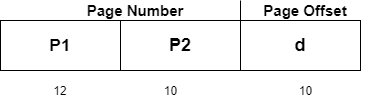
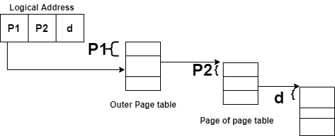
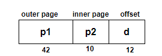
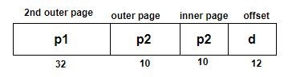
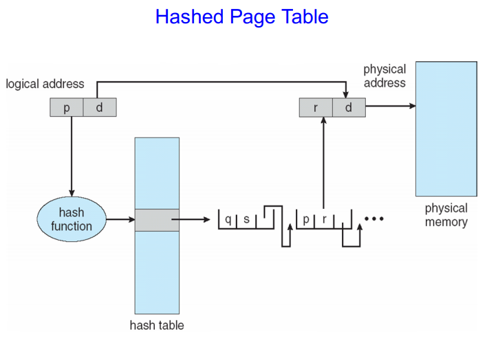

Paging is a memory management scheme that eliminates the need for a contiguous allocation of physical memory. The process of retrieving processes in the form of pages from the secondary storage into the main memory is known as paging. The basic purpose of paging is to separate each procedure into pages. Additionally, frames will be used to split the main memory. This scheme permits the physical address space of a process to be non – contiguous.

In paging, the physical memory is divided into fixed-size blocks called **page frames**, which are the same size as the pages used by the process. The process’s logical address space is also divided into fixed-size blocks called **pages**, which are the same size as the page frames. When a process requests memory, the operating system allocates one or more page frames to the process and maps the process’s logical pages to the physical page frames.

Logical Address or Virtual Address: This is a deal that is generated through the CPU

Physical Address

The mapping from virtual to physical address is done by the Memory Management Unit (MMU) which is a hardware device and this mapping is known as the paging technique

Reference: https://www.geeksforgeeks.org/paging-in-operating-system/

PTBR means page table base register and it is basically used to hold the base address for the page table of the current process.

Reference: https://www.studytonight.com/operating-system/structure-of-page-table-in-operating-systems

# Multi-Level Page Table

## 2 Level Page Table

32-bit logical address space and a page size of 1 KB. logical add. further divided into:

Page Number: 22 bits., Page Offset : 10 bits.

Page Number consisting of 12 bits, Page Offset consisting of 10 bits.

Thus the Logical address is as follows:

P1 is an index into the Outer Page table, P2 indicates the displacement within the page of the Inner page Table.

As address translation works from outer page table inward so is known as forward-mapped Page Table.

Below given figure below shows the Address Translation scheme for a two-level page table

## 3 Level Page Table
For 64-bit logical address space, a two-level paging scheme is not appropriate. Page size, in this case, is 4KB.If in this case, we will use the two-page level scheme then the addresses will look like this:

To avoid such a large table, divide the outer page table, it will result in a Three-level page table:

Reference: https://www.studytonight.com/operating-system/structure-of-page-table-in-operating-systems

# Hashed Page Table

## Definitions
In the diagram:

Virtual Page Number (VPN): `p`, `q`
Page Frame Number (PFN): `r`
Offset: `d`
Hash Function: `h(x)`
Hashed Page Table with schema `(key, VPN, PFN, Pointer to next entry with key)` for each entry in the table
It so happens that `h(p) = same_key` and `h(q) = same_key`. There is hash collision. Both `p` and `q` are hashed to the `same_key`.

This is resolved by chaining the entry with `VPN = q` to the entry with `VPN = p`. Chaining means to use the `Pointer` field in the entry with `VPN = q` to **point** to the entry with `VPN = p`.

## Workflow
Operating system (OS) grabs `p` from the CPU, and performs `h(p)` to get `same_key`.

OS looks up the first entry in the Hashed Page Table with `key = same_key` and checks `p` against the first entry's `VPN` field. It checks `p` against `q`. This is incorrect.

OS uses the `Pointer` in the first entry to find the second entry. It knows that the second entry has the same `key = same_key`, because the Page Table is constructed this way. OS checks `p` against the seond entry's `VPN` field. It checks `p` against `p`. This is correct. Bam. Kill confirmed.

OS knows that this is the correct entry it is looking for. It grabs `PFN` from the second entry. It grabs `r`. `r` is the correct physical frame number that corresponds to virtual page number `p`.

OS uses `r` to look for the physical frame it wants in physical memory, and looks for the exact word wanted which is offset by `d` within frame `r` in physical memory. OS grabs the contents of the word and we're done.

Reference:
https://cs.stackexchange.com/questions/85207/explain-hashed-page-tables-in-operating-system

# Important Points About Paging in Operating Systems
## Reduces internal fragmentation: 
Paging facilitates lessening internal fragmentation by using allocating memory in fixed-size blocks (pages), which might be usually a whole lot smaller than the size of the process’s facts segments. This lets in for greater efficient use of memory in view that there are fewer unused bytes in each block.
## Efficient Memory Allocation: 
Paging enables memory to be allocated on call for, this means that memory is most effectively allocated when it’s far needed. This allows for extra efficient use of memory in view that only the pages that are absolutely used by the manner want to be allocated inside the physical memory.
## Protection and sharing of memory: 
Paging allows for the protection and sharing of memory between methods, as each procedure has its own page table that maps its logical deal with area to its physical address space. This permits techniques to proportion facts at the same time as preventing unauthorized get right of entry to every other’s memory.
## External fragmentation: 
Paging can result in outside fragmentation, wherein memory turns fragmented into small, non-contiguous blocks. This can make it difficult to allocate massive blocks of memory to a method seeing that there may not be enough contiguous free memory to be had.
## Overhead: 
Paging involves overhead because of the renovation of the web page table and the translation of logical addresses to physical addresses. The working device must maintain the page table for each manner and perform a deal with translation whenever a procedure accesses memory, which can slow down the machine.

Reference: https://www.geeksforgeeks.org/paging-in-operating-system/
