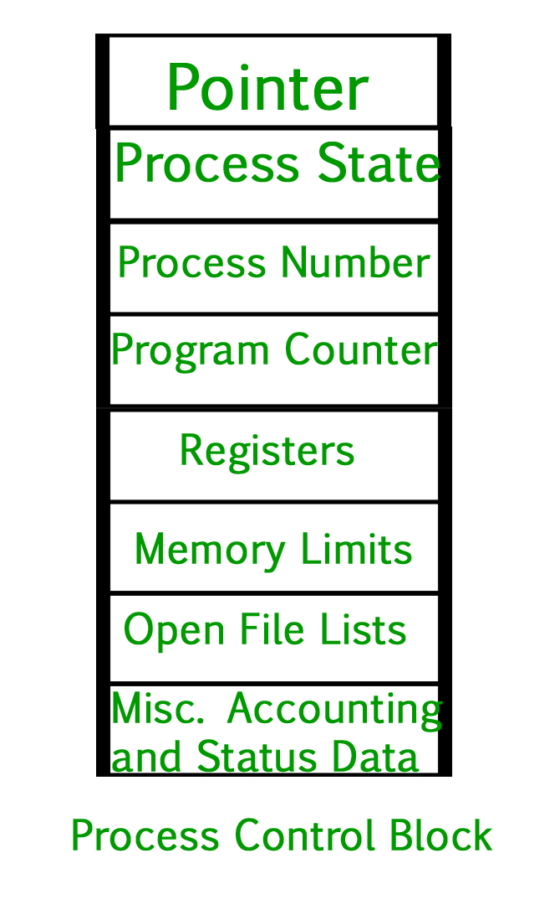

# Process Scheduler
Process scheduling is the activity of the process manager that handles the removal of the running process from the CPU and the selection of another process based on a particular strategy. 
Process scheduling is an essential part of a Multiprogramming operating system. Such operating systems allow more than one process to be loaded into the executable memory at a time and the loaded process shares the CPU using time multiplexing.

# Categories of Scheduling
## Non-preemptive: 
Process’s resource cannot be taken before the process has finished running. When a running process finishes and transitions to a waiting state, resources are switched.
## Preemptive: 
OS assigns resources to a process for a predetermined period. The process switches from running state to ready state or from waiting for state to ready state during resource allocation. 
This switching happens because the CPU may give other processes priority and substitute the currently active process for the higher priority process.

# Types of Process Schedulers
## Long Term or Job Scheduler
Brings the new process to the ‘Ready State’. It controls the Degree of Multi-programming, i.e., the number of processes present in a ready state at any point in time. It is important that the long-term scheduler make a careful selection of both I/O and CPU-bound processes. 
I/O-bound tasks are which use much of their time in input and output operations while CPU-bound processes are which spend their time on the CPU. The job scheduler increases efficiency by maintaining a balance between the two. They operate at a high level and are typically used in batch-processing systems.

## Short-Term or CPU Scheduler
Responsible for selecting one process from the ready state for scheduling it on the running state. Note: Short-term scheduler only selects the process to schedule it doesn’t load the process on running.  Here is when all the scheduling algorithms are used. The CPU scheduler is responsible for ensuring no starvation due to high burst time processes.

    ### Dispatcher
    Responsible for loading the process selected by the Short-term scheduler on the CPU (Ready to Running State) Context switching is done by the dispatcher only. A dispatcher does the following: 
    1. Switching context.
    2. Switching to user mode.
    3. Jumping to the proper location in the newly loaded program.

## Medium-Term Scheduler
Responsible for suspending and resuming the process. It mainly does swapping (moving processes from main memory to disk and vice versa). Swapping may be necessary to improve the process mix or because a change in memory requirements has overcommitted available memory, requiring memory to be freed up. It is helpful in maintaining a perfect balance between the I/O bound and the CPU bound. It reduces the degree of multiprogramming.

## Comparison
| Long Term Scheduler	| Short term schedular	| Medium Term Scheduler |
| --- | --- | --- | 
| It is a job scheduler	| It is a CPU scheduler	| It is a process-swapping scheduler |
| Generally, Speed is lesser than short term scheduler	| Speed is the fastest among all of them	| Speed lies in between both short and long-term schedulers |
| It controls the degree of multiprogramming	| It gives less control over how much multiprogramming is done | It reduces the degree of multiprogramming |
| It is barely present or nonexistent in the time-sharing system	| It is a minimal time-sharing system	| It is a component of systems for time sharing |
| It can re-enter the process into memory, allowing for the continuation of execution | It selects those processes which are ready to execute	| It can re-introduce the process into memory and execution can be continued |

# Other types of Process Schedulers
## I/O schedulers: 
I/O schedulers are in charge of managing the execution of I/O operations such as reading and writing to discs or networks. They can use various algorithms to determine the order in which I/O operations are executed, such as FCFS (First-Come, First-Served) or RR (Round Robin).
## Real-time schedulers: 
In real-time systems, real-time schedulers ensure that critical tasks are completed within a specified time frame. They can prioritize and schedule tasks using various algorithms such as EDF (Earliest Deadline First) or RM (Rate Monotonic).

# Context Switching
For a process execution to be continued from the same point at a later time, context switching is a mechanism to store and restore the state or context of a CPU in the Process Control block. A context switcher makes it possible for multiple processes to share a single CPU using this method. A multitasking operating system must include context switching among its features.

The state of the currently running process is saved into the process control block when the scheduler switches the CPU from executing one process to another. The state used to set the computer, registers, etc. for the process that will run next is then loaded from its own PCB. After that, the second can start processing.

Reference: https://www.geeksforgeeks.org/process-schedulers-in-operating-system/

# Process Control Block & Process Table
While creating a process, the operating system performs several operations. To identify the processes, it assigns a process identification number (PID) to each process. As the operating system supports multi-programming, it needs to keep track of all the processes. For this task, the process control block (PCB) is used to track the process’s execution status. Each block of memory contains information about the process state, program counter, stack pointer, status of opened files, scheduling algorithms, etc.

All this information is required and must be saved when the process is switched from one state to another. When the process makes a transition from one state to another, the operating system must update information in the process’s PCB. A process control block (PCB) contains information about the process, i.e. registers, quantum, priority, etc. The process table is an array of PCBs, that means logically contains a PCB for all of the current processes in the system.

1. Pointer: It is a stack pointer that is required to be saved when the process is switched from one state to another to retain the current position of the process.
2. Process state: It stores the respective state of the process.
3. Process number: Every process is assigned a unique id known as process ID or PID which stores the process identifier.
4. Program counter: It stores the counter,: which contains the address of the next instruction that is to be executed for the process.
5. Register: These are the CPU registers which include the accumulator, base, registers, and general-purpose registers.
6. Memory limits: This field contains the information about memory management system used by the operating system. This may include page tables, segment tables, etc.
7. Open files list : This information includes the list of files opened for a process.
